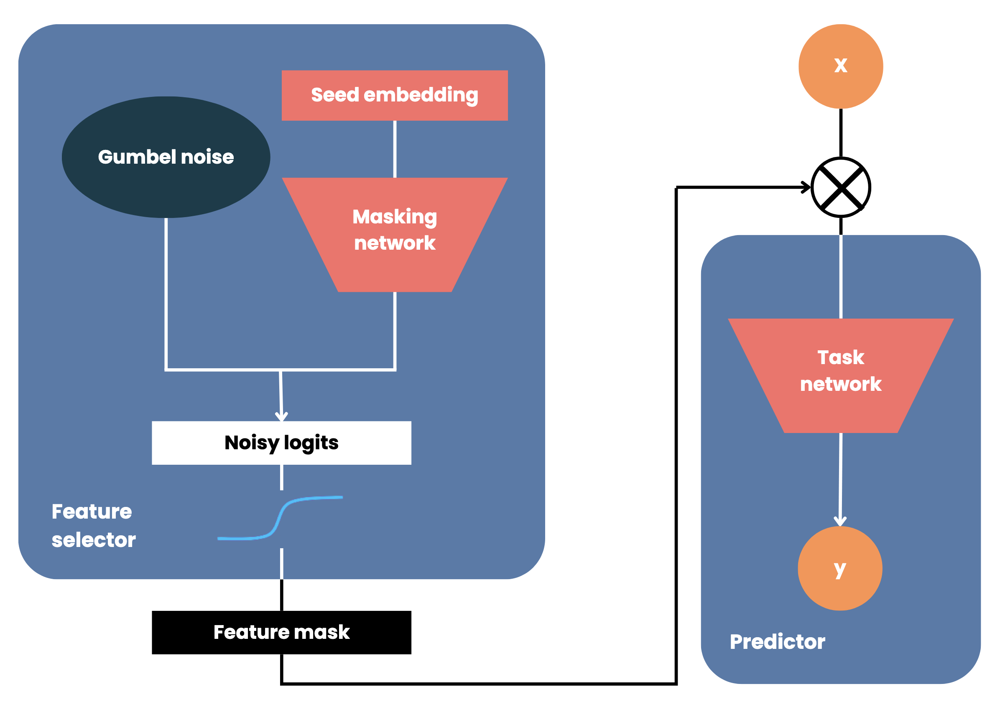
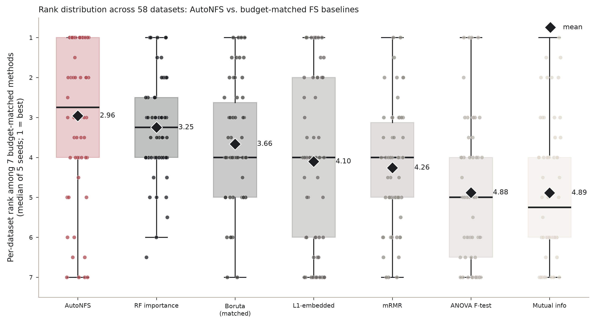
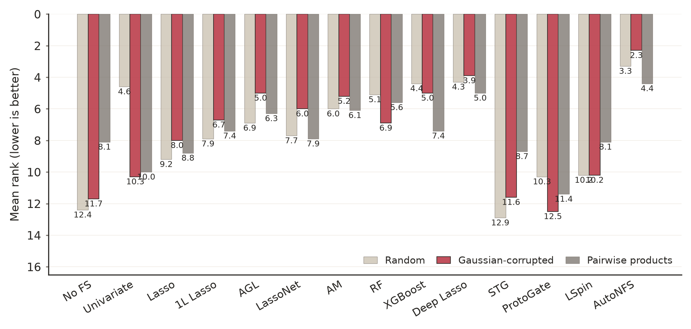
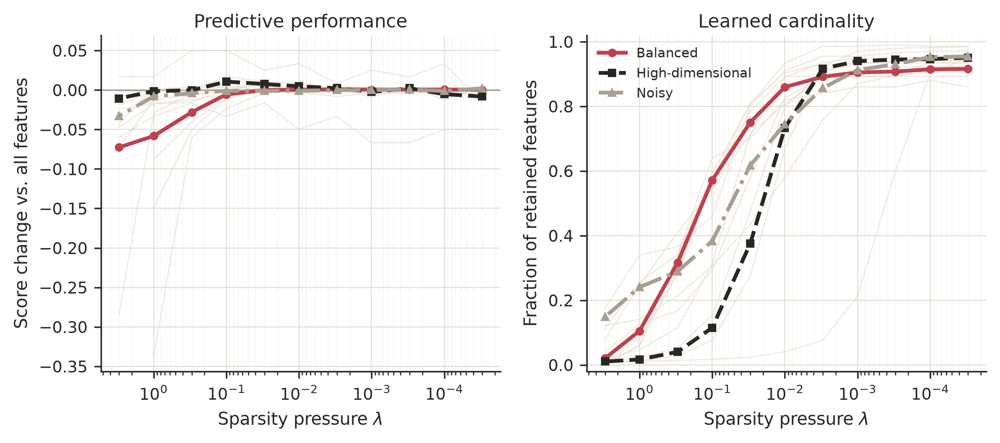
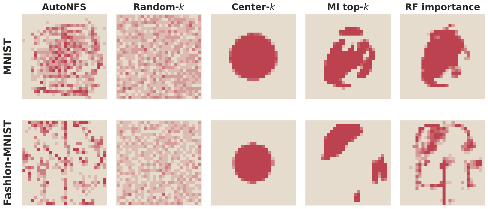

# AutoNFS

AutoNFS is a global neural feature selector that jointly learns which features to retain and how
many to select. A learned embedding projection generates feature-level logits, while annealed
Gumbel-Sigmoid gates optimize a compact dataset-level mask together with a task predictor.



## Adaptive `balance`

`balance` trades feature-selection aggressiveness against risk of mask collapse. Default is
`auto` (adaptive). Pass `balance="auto"` to back off automatically per-dataset if
`1.0` collapses or underperforms; see `autonfs/adaptive.py` for the implementation.

## Stability selection (default, `stability_selection=True`)

`balance="auto"` fixes *most* mask collapses, but a single Gumbel-softmax training run is still a
stochastic point estimate: on some datasets/seeds the mask still collapses to 0 features even at
the adaptive-resolved `balance`, and on many more the selected set is noisier than it needs to be.
By default, `AutoNFS.fit` now trains an ensemble of `n_members` (default 9) independent networks at
the same resolved `balance` (via `autonfs.ensemble.train_gumbel_ensemble`, which batches all members
into one training loop at roughly the same wall-clock cost as a handful of sequential runs) and
keeps a feature iff at least `stability_tau` (default 1/3) of members select it in their own vote.

In a follow-up study across 37 datasets (17 wide gene-expression/microarray panels + 20 balanced or
noisy tabular datasets) × 5 seeds, comparing this stability vote against the plain `balance="auto"`
single-run default (both reusing the identical resolved `balance` per dataset/seed, so the
comparison isolates the ensemble vote from the balance search):

- Mean downstream balanced accuracy rose from **0.847 to 0.864** (paired Wilcoxon signed-rank
  `p = 0.0013`, 185 dataset/seed pairs), with a positive win-rate against the single-run baseline.
- All 3 residual mask collapses (`k=0`) still produced by the single-run default under
  `balance="auto"` (on `kc2` and `sonar`, both borderline/noisy tabular datasets) were eliminated,
  with **no new collapses introduced** on any of the 185 pairs.
- The improvement is concentrated on the harder `balanced_or_noisy` tier (mean score 0.797 → 0.826,
  `p = 0.0018`); on the `high_dim` tier the two are statistically indistinguishable (0.906 → 0.909,
  `p = 0.14`) — the ensemble vote mainly helps where a single stochastic run is least reliable, and
  doesn't cost anything where it was already reliable.
- `stability_tau=1/3` was the best of the thresholds tried (`{0.33, 0.5}` for the vote-frequency
  ensemble; also compared against a logit-probability-averaging ensemble at `{0.3, 0.4, 0.5}`, which
  underperformed the single-run baseline at every threshold tried).

Pass `stability_selection=False` to recover the original single-run behavior (one training run, one
stochastic vote) if you need the lower, non-ensemble compute cost or want to reproduce results from
before this change.

**Known caveat.** On 2 of the 38 datasets in the validation cohort (`MagicTelescope`, `sonar`), the
*upstream* `balance="auto"` backoff search itself — not the stability vote — occasionally resolves to
a different `balance` across outer CV seeds, because the search's accept/reject decision sits right at
its `adaptive_threshold_frac` boundary and is sensitive to the internal seeds' sampling noise on these
two datasets. This produces higher seed-to-seed variance in the selected feature count on exactly
these two datasets than on the rest of the cohort. We tried two fixes — a stricter acceptance floor on
`median_n_selected` and a coefficient-of-variation guard on the internal seeds, plus simply raising
`adaptive_n_seeds` from 5 to 9 — none generalized: each helped one of the two datasets while doing
nothing or making the other worse, so none is adopted as a new default. This is a preexisting property
of `balance="auto"`'s search (present with `stability_selection=False` too, just partially masked by
looking at only one run), not a regression introduced by stability selection; both eliminated all
whole-mask collapses previously seen on `sonar`, so the raw failure mode this feature targets is fixed
even on these two datasets.

## Matched-cardinality benchmark

The paper benchmark evaluates AutoNFS against eight feature selectors on **58 balanced, noisy,
and high-dimensional datasets**, with five seeds per dataset. Every comparator receives the exact
feature count selected by AutoNFS on the corresponding run. This controls compression and tests
which method identifies the more predictive subset at the same cardinality. Scores are aggregated
as the median over seeds before ranking each dataset.

The benchmark uses the paper's fixed research configuration: one AutoNFS run with 150 epochs,
batch size 32, `temperature_decay=0.997`, and `balance=1.0`. It intentionally does not use the
adaptive balance search or stability ensemble enabled by the package defaults.

<details>
<summary>Per-dataset statistics for the 58 benchmark datasets (click to expand)</summary>

| Dataset | Tier | Task | n samples (orig.) | n samples (used) | n features | n classes | Source |
|---|---|---|---|---|---|---|---|
| `Bioresponse` | balanced | classification | 2,000 | 2,000 | 1,776 | 2 | OpenML |
| `Fashion-MNIST` | balanced | classification | 70,000 | 6,000 * | 784 | 10 | OpenML |
| `MagicTelescope` | balanced | classification | 19,020 | 6,000 * | 10 | 2 | OpenML |
| `adult` | balanced | classification | 48,842 | 6,000 * | 105 | 2 | OpenML |
| `arcene` | balanced | classification | 200 | 200 | 10,000 | 2 | OpenML |
| `bank-marketing` | balanced | classification | 45,211 | 6,000 * | 51 | 2 | OpenML |
| `breast_cancer` | balanced | classification | 569 | 569 | 30 | 2 | sklearn |
| `california_housing` | balanced | regression | 20,640 | 6,000 * | 13 | regression | OpenML |
| `cnae-9` | balanced | classification | 1,080 | 1,080 | 856 | 9 | OpenML |
| `covertype` | balanced | classification | 110,393 | 6,000 * | 54 | 7 | OpenML |
| `cpu_act` | balanced | regression | 8,192 | 6,000 * | 21 | regression | OpenML |
| `diabetes` | balanced | regression | 442 | 442 | 10 | regression | sklearn |
| `digits` | balanced | classification | 1,797 | 1,797 | 64 | 10 | sklearn |
| `eeg-eye-state` | balanced | classification | 14,980 | 6,000 * | 14 | 2 | OpenML |
| `electricity` | balanced | classification | 45,312 | 6,000 * | 8 | 2 | OpenML |
| `elevators` | balanced | regression | 16,599 | 6,000 * | 18 | regression | OpenML |
| `gas-drift` | balanced | classification | 13,910 | 6,000 * | 128 | 6 | OpenML |
| `gisette` | balanced | classification | 2,000 | 2,000 | 5,000 | 2 | OpenML |
| `har` | balanced | classification | 10,299 | 6,000 * | 561 | 6 | OpenML |
| `house_16H` | balanced | regression | 22,784 | 6,000 * | 16 | regression | OpenML |
| `ionosphere` | balanced | classification | 351 | 351 | 34 | 2 | OpenML |
| `isolet` | balanced | classification | 7,797 | 6,000 * | 617 | 26 | OpenML |
| `madelon` | balanced | classification | 2,600 | 2,600 | 500 | 2 | OpenML |
| `mfeat-pixel` | balanced | classification | 2,000 | 2,000 | 240 | 10 | OpenML |
| `mnist_784` | balanced | classification | 70,000 | 6,000 * | 784 | 10 | OpenML |
| `nomao` | balanced | classification | 34,465 | 6,000 * | 118 | 2 | OpenML |
| `ozone-level-8hr` | balanced | classification | 2,534 | 2,534 | 72 | 2 | OpenML |
| `phoneme` | balanced | classification | 5,404 | 5,404 | 5 | 2 | OpenML |
| `pol` | balanced | regression | 15,000 | 6,000 * | 48 | regression | OpenML |
| `semeion` | balanced | classification | 1,593 | 1,593 | 256 | 10 | OpenML |
| `sonar` | balanced | classification | 208 | 208 | 60 | 2 | OpenML |
| `spambase` | balanced | classification | 4,601 | 4,601 | 57 | 2 | OpenML |
| `splice` | balanced | classification | 3,190 | 3,190 | 287 | 3 | OpenML |
| `superconduct` | balanced | regression | 21,263 | 6,000 * | 81 | regression | OpenML |
| `synth_clf_highdim` | balanced | classification | 400 | 400 | 500 | 2 | synthetic |
| `synth_reg_highdim` | balanced | regression | 400 | 400 | 200 | regression | synthetic |
| `wine` | balanced | classification | 178 | 178 | 13 | 3 | sklearn |
| `gas_drift_diffconc` | noisy | classification | 13,910 | 6,000 * | 129 | 6 | OpenML |
| `hill_valley` | noisy | classification | 1,212 | 1,212 | 100 | 2 | OpenML |
| `musk` | noisy | classification | 6,598 | 6,000 * | 268 | 2 | OpenML |
| `plants_margin` | noisy | classification | 1,600 | 1,600 | 64 | 100 | OpenML |
| `plants_shape` | noisy | classification | 1,600 | 1,600 | 64 | 100 | OpenML |
| `plants_texture` | noisy | classification | 1,599 | 1,599 | 64 | 100 | OpenML |
| `waveform_5000` | noisy | classification | 5,000 | 5,000 | 40 | 3 | OpenML |
| `11_Tumors` | high_dim | classification | 174 | 174 | 12,533 | 11 | OpenML |
| `AP_Breast_Kidney` | high_dim | classification | 604 | 604 | 10,935 | 2 | OpenML |
| `AP_Colon_Kidney` | high_dim | classification | 546 | 546 | 10,935 | 2 | OpenML |
| `AP_Endometrium_Breast` | high_dim | classification | 405 | 405 | 10,935 | 2 | OpenML |
| `DLBCL` | high_dim | classification | 77 | 77 | 5,469 | 2 | OpenML |
| `GCM` | high_dim | classification | 190 | 190 | 16,063 | 14 | OpenML |
| `OVA_Breast` | high_dim | classification | 1,545 | 1,545 | 10,935 | 2 | OpenML |
| `OVA_Kidney` | high_dim | classification | 1,545 | 1,545 | 10,935 | 2 | OpenML |
| `OVA_Lung` | high_dim | classification | 1,545 | 1,545 | 10,935 | 2 | OpenML |
| `SRBCT` | high_dim | classification | 83 | 83 | 2,308 | 4 | OpenML |
| `colon_cancer` | high_dim | classification | 62 | 62 | 2,000 | 2 | OpenML |
| `gina_agnostic` | high_dim | classification | 3,468 | 3,468 | 970 | 2 | OpenML |
| `leukemia` | high_dim | classification | 72 | 72 | 7,129 | 2 | OpenML |
| `micro_mass` | high_dim | classification | 360 | 360 | 1,300 | 10 | OpenML |

Full machine-readable version: [`docs/dataset_statistics.csv`](docs/dataset_statistics.csv).

</details>



| Method | Mean rank | Holm-adjusted p vs. AutoNFS |
|---|---:|---:|
| **AutoNFS** | **3.54** | — |
| RF importance | 4.11 | .072 |
| LassoNet | 4.56 | **.025** |
| Boruta (matched) | 4.59 | **.046** |
| L1 embedded | 5.09 | **.002** |
| mRMR | 5.34 | **.002** |
| STG | 5.55 | **<.001** |
| ANOVA | 6.09 | **<.001** |
| Mutual information | 6.14 | **<.001** |

AutoNFS obtains the best aggregate rank and the best rank on 17 of 58 datasets. After Holm
correction over all eight comparisons, it significantly outperforms seven alternatives. Against
LassoNet it wins/ties/loses on 36/6/16 datasets; against STG the corresponding counts are 43/3/12.
RF importance is the closest comparator and is not significantly different after correction
(`p=.072`).

Unconstrained Boruta is a separate reference operating point rather than a peer in this ranking.
It retains a median 47.2% of features, compared with 11.3% for AutoNFS, so its raw accuracy reflects
a different accuracy-compression trade-off.

## Corruption benchmark

Following the performance-driven feature-selection benchmark, 11 OpenML datasets are augmented
with independent random variables, Gaussian-corrupted copies, or pairwise products. AutoNFS
discovers its own cardinality, while competing selectors receive the original uncorrupted feature
count.



AutoNFS has the best mean rank in all three settings: **3.3** for random variables, **2.3** for
Gaussian-corrupted copies, and **4.4** for pairwise products. Its selected subsets contain no
introduced variables on average in the random and Gaussian-copy settings. The mean introduced
fraction is 0.17 for pairwise products, which can themselves encode predictive interactions.

## Sensitivity to `balance`



Across 12 balanced, high-dimensional, and noisy datasets with five seeds, predictive performance
is stable over a broad region of the accuracy-sparsity trade-off. For `balance` values from 0.03 to
1, the median absolute accuracy difference from the all-features baseline is 0.010. At the common
paper setting `balance=1`, the retained fraction ranges from 1.1% on `gisette` to 34.0% on
`waveform_5000`, confirming that `balance` is not a hidden target feature count.

## Cross-model mask transfer

AutoNFS learns masks jointly with an MLP, but the selected columns can be reused by independent
predictors. Across 18 Curated Metagenomics Data cohorts, it removes **92%** of microbial features
on average. Mean MLP accuracy changes from 62.17% to 63.72%, while mean random-forest accuracy
changes from 73.57% to 75.63%. These are single recorded runs per cohort and should be interpreted
as evidence of compression and possible transfer rather than uncertainty-controlled improvement.

On MNIST and Fashion-MNIST, a separately initialized Vision Transformer is trained from scratch on
the selected pixels. AutoNFS retains 24.4% and 17.4% of pixels respectively, while preserving
99.57% and 98.27% of the corresponding full-image ViT mean accuracy.



## Key hyperparameters

Only `balance` has a large effect on results; the rest are safe to leave at their defaults for most
datasets and are listed mainly for completeness / fine-tuning.

| Hyperparameter | Default | Suggested grid to sweep | Notes |
|---|---|---|---|
| `balance` | `"auto"` | `"auto"` vs. fixed values on the log grid `1.0, 0.3, 0.1, 0.03, 0.01, 0.003, 0.001, 0.0003, 0.0001` | Dominant axis by far. Fixed `1.0` (max selection pressure) collapses the mask on a majority of seeds on several datasets; `"auto"` backs off per-dataset only as far as needed and stayed at `1.0` on 7 of 11 validation datasets. Tune this first, and only as a fixed value if you've already checked it doesn't collapse on your data. |
| `batch_size` | `32` | `16, 32, 64` | `1` was rejected outright — 30–500x slower with no selection-quality benefit, since the mask depends on a single global embedding, not per-sample batching. Full-batch (`batch_size=n_samples`) is faster still but causes its own collapse; avoid it. |
| `epochs` | `150` | `100, 150, 200, 300` | 150–300 were statistically equivalent in the sweep; 150 is the fastest of that tied group. |
| `temperature_decay` | `0.997` | `0.99, 0.995, 0.997, 0.999` | Modest, dataset-independent effect once `balance` and `batch_size` are set correctly. |
| `target_features_mode` | `"raw"` | `"raw"`, `"auto"` | Tied for best in the sweep; `"raw"` kept as it requires no other behavior change. |
| `adaptive_threshold_frac` | `0.9` | `0.85, 0.9, 0.95` | Only relevant when `balance="auto"`. Minimum fraction of the all-features baseline score a backed-off `balance` must retain; lower values let the search settle on more aggressive (smaller) feature sets at some accuracy cost. |
| `adaptive_n_seeds` | `5` | `3, 5, 8` | Only relevant when `balance="auto"`. Seeds averaged per grid point before deciding to back off; higher is more robust but costs proportionally more fits during the search. |
| `stability_selection` | `True` | `True, False` | Ensemble vote-frequency selection vs. the original single training run. Raises mean downstream balanced accuracy (0.847 → 0.864 across 37 datasets, `p = 0.0013`) and removes residual mask collapses that `balance="auto"` alone doesn't catch; set `False` for the original lower-cost single-run behavior. |
| `n_members` | `9` | `5, 9, 15` | Only relevant when `stability_selection=True`. Ensemble size for the stability vote; diminishing returns were found beyond ~9 members while cost grows linearly. |
| `stability_tau` | `1/3` | `0.33, 0.5` | Only relevant when `stability_selection=True`. Minimum fraction of members that must select a feature to keep it; `1/3` was the best-performing threshold in the sweep — higher values trade recall for precision and increase collapse risk. |

## Installation
To install the package, you can use pip:
```bash
pip install autonfs
```

## Usage examples
### Basic usage
```python
from autonfs import AutoNFS
from sklearn.datasets import load_breast_cancer

breast = load_breast_cancer()
X = breast.data
y = breast.target

gfs = AutoNFS()
X = gfs.fit_transform(X, y)

print(gfs.support_)
print(gfs.scores_)
```

### Performance verification
```python
from autonfs import AutoNFS
from sklearn.datasets import load_breast_cancer
from sklearn.model_selection import train_test_split
from sklearn.ensemble import RandomForestClassifier
from sklearn.metrics import balanced_accuracy_score

DEVICE = "cpu"

breast = load_breast_cancer()
X = breast.data
y = breast.target

X_train, X_test, y_train, y_test = train_test_split(X, y, test_size=0.2, random_state=42)
clf = RandomForestClassifier(random_state=42)
clf.train(X_train, y_train)
orig_score = balanced_accuracy_score(y_test, clf.predict(X_test))

print(f"Original score: {orig_score:.3f}. Original features: {X.shape[1]}")
# Original score: 0.958. Original features: 30

gfs = AutoNFS(verbose=True, device=DEVICE)
gfs.fit(X_train, y_train)

X_transformed = gfs.transform(X_train)
X_test_transformed = gfs.transform(X_test)

clf.fit(X_transformed, y_train)
y_pred = clf.predict(X_test_transformed)
score = balanced_accuracy_score(y_test, y_pred)
logger.info(f"Score after feature selection: {score}. Selected features: {sum(gfs.support_)}")
# Score after feature selection: 0.958. Selected features: 3
```
