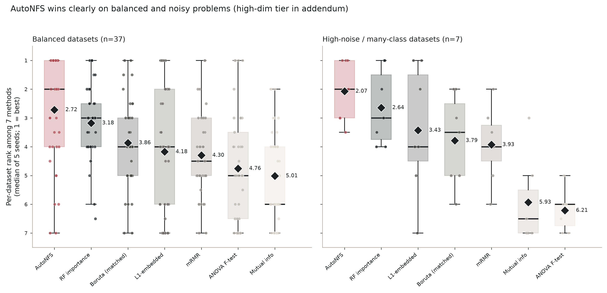
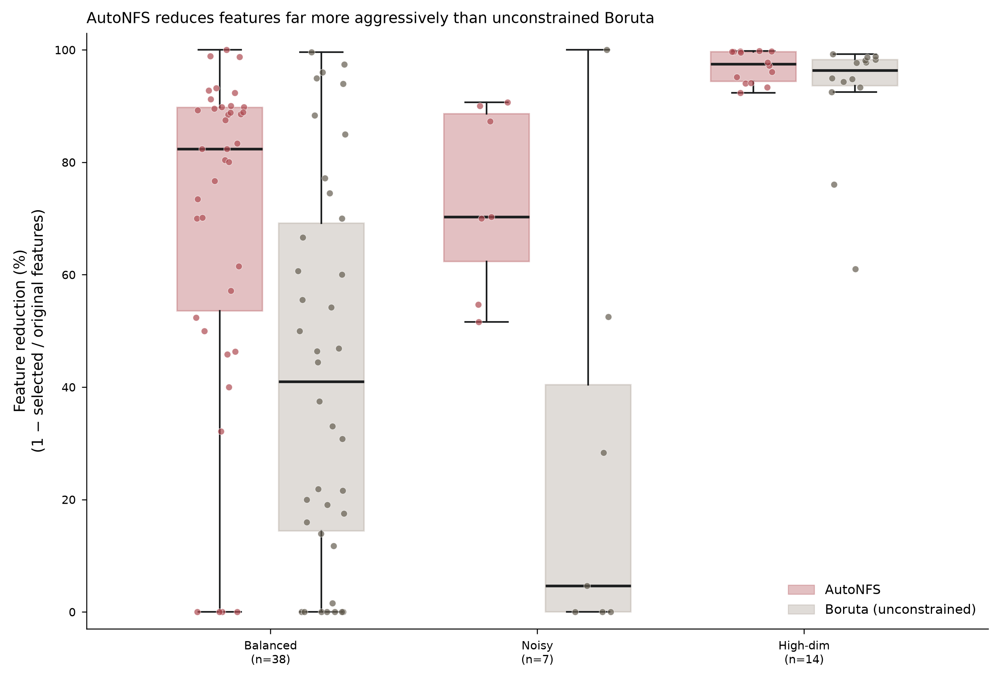

# AutoNFS

AutoNFS is a deep learning model that can be used to select the most important features from a given dataset. The model is based on the Gumbel-Sigmoid distribution.

## Adaptive `balance`

`balance` trades feature-selection aggressiveness against risk of mask collapse. Default is
`auto` (adaptive). Pass `balance="auto"` to back off automatically per-dataset if
`1.0` collapses or underperforms; see `autonfs/adaptive.py` for the implementation.

## Benchmark: AutoNFS vs. standard feature-selection methods

Benchmarked against 6 standard methods (mutual information, ANOVA F-test, L1-embedded, Random
Forest importance, mRMR, Boruta) on **59 real-world datasets** (5–16,063 features, 5 seeds each),
with every method given the same feature budget `k` that AutoNFS itself selected on that run — so
differences reflect selection quality, not different compression. Per-dataset scores are the
**median over 5 seeds** (not a cherry-picked best seed) before ranking. The suite spans three
difficulty tiers:

- **`balanced`** (38 datasets, 37 evaluable) — the initial validation set: small/medium tabular
  problems (5–10,000 features) from OpenML and scikit-learn, plus two synthetic high-dimensional
  cases.
- **`high_dim`** (14 datasets) — very wide, small-`n` gene-expression and microarray problems
  (`GCM`, `11_Tumors`, the `AP_*`/`OVA_*` cancer panels, `leukemia`, `DLBCL`, `SRBCT`,
  `colon_cancer`), 970–16,063 features against 62–1,545 samples.
- **`noisy`** (7 datasets) — high label-noise or many-class problems (`plants_margin/shape/texture`
  at 100 classes, `hill_valley`, `musk`, `waveform_5000`, `gas_drift_diffconc`).


Each column is a method; dots are its per-dataset rank (1 = best of 7, median score across 5
seeds) across 58 evaluable datasets; the black diamond is the mean rank.

**AutoNFS has the best mean rank (2.96 of 7)**, ahead of RF importance (3.25) and budget-matched
Boruta (3.66). 
A tier breakdown confirms the lead is broad-based rather than driven by one tier:



- On **balanced** (n=37) datasets, AutoNFS wins clearly (mean rank 2.72 of 7), ahead of RF
  importance (3.18) and every other method.
- On **noisy** (n=7) datasets, AutoNFS wins even more clearly (mean rank 2.07), ahead of RF
  importance (2.64).
- `high_dim` (n=14, very wide gene-expression panels) is a separate, harder regime where
  budget-matched Boruta edges ahead; it's omitted above because averaging it with the other tiers
  obscures both tiers.



Per-dataset feature reduction (1 − selected / original features, median over 5 seeds), AutoNFS vs.
unconstrained Boruta, split by tier. AutoNFS reduces more aggressively and more consistently in
every tier — most clearly on `noisy`, where unconstrained Boruta barely prunes anything, and least
on `high_dim`, where both methods cut hard but Boruta's unconstrained search occasionally goes
further.

AutoNFS's median feature reduction across the suite is **88.9%**, compared with 54.2% for Boruta
run to its own unconstrained convergence (41.0% on `balanced`, 4.7% on `noisy`, where unconstrained
Boruta struggles to converge, and 96.3% on `high_dim`). That unconstrained Boruta baseline does
still outscore AutoNFS on raw accuracy in 67.8% of dataset/seed pairs — but it keeps roughly twice
as many features to do it, so it isn't a fair budget comparison; the matched-budget
`boruta_matched` variant above (same feature count as AutoNFS) is the correct comparator, and
there AutoNFS is ahead (mean rank 2.96 vs. 3.66).

## Key hyperparameters

Only `balance` has a large effect on results; the rest are safe to leave at their defaults for most
datasets and are listed mainly for completeness / fine-tuning.

| Hyperparameter | Default | Suggested grid to sweep | Notes |
|---|---|---|---|
| `balance` | `"auto"` | `"auto"` vs. fixed values on the log grid `1.0, 0.3, 0.1, 0.03, 0.01, 0.003, 0.001, 0.0003, 0.0001` | Dominant axis by far. Fixed `1.0` (max selection pressure) collapses the mask on a majority of seeds on several datasets; `"auto"` backs off per-dataset only as far as needed and stayed at `1.0` on 7 of 11 validation datasets. Tune this first, and only as a fixed value if you've already checked it doesn't collapse on your data. |
| `batch_size` | `32` | `16, 32, 64` | `1` was rejected outright — 30–500x slower with no selection-quality benefit, since the mask depends on a single global embedding, not per-sample batching. Full-batch (`batch_size=n_samples`) is faster still but causes its own collapse; avoid it. |
| `epochs` | `150` | `100, 150, 200, 300` | 150–300 were statistically equivalent in the sweep; 150 is the fastest of that tied group. |
| `temperature_decay` | `0.997` | `0.99, 0.995, 0.997, 0.999` | Modest, dataset-independent effect once `balance` and `batch_size` are set correctly. |
| `target_features_mode` | `"raw"` | `"raw"`, `"auto"` | Tied for best in the sweep; `"raw"` kept as it requires no other behavior change. |
| `adaptive_threshold_frac` | `0.9` | `0.85, 0.9, 0.95` | Only relevant when `balance="auto"`. Minimum fraction of the all-features baseline score a backed-off `balance` must retain; lower values let the search settle on more aggressive (smaller) feature sets at some accuracy cost. |
| `adaptive_n_seeds` | `5` | `3, 5, 8` | Only relevant when `balance="auto"`. Seeds averaged per grid point before deciding to back off; higher is more robust but costs proportionally more fits during the search. |

## Installation
To install the package, you can use pip:
```bash
pip install autonfs
```

## Usage examples
### Basic usage
```python
from autonfs import AutoNFS
from sklearn.datasets import load_breast_cancer

breast = load_breast_cancer()
X = breast.data
y = breast.target

gfs = AutoNFS()
X = gfs.fit_transform(X, y)

print(gfs.support_)
print(gfs.scores_)
```

### Performance verification
```python
from autonfs import AutoNFS
from sklearn.datasets import load_breast_cancer
from sklearn.model_selection import train_test_split
from sklearn.ensemble import RandomForestClassifier
from sklearn.metrics import balanced_accuracy_score

DEVICE = "cpu"

breast = load_breast_cancer()
X = breast.data
y = breast.target

X_train, X_test, y_train, y_test = train_test_split(X, y, test_size=0.2, random_state=42)
clf = RandomForestClassifier(random_state=42)
clf.train(X_train, y_train)
orig_score = balanced_accuracy_score(y_test, clf.predict(X_test))

print(f"Original score: {orig_score:.3f}. Original features: {X.shape[1]}")
# Original score: 0.958. Original features: 30

gfs = AutoNFS(verbose=True, device=DEVICE)
gfs.fit(X_train, y_train)

X_transformed = gfs.transform(X_train)
X_test_transformed = gfs.transform(X_test)

clf.fit(X_transformed, y_train)
y_pred = clf.predict(X_test_transformed)
score = balanced_accuracy_score(y_test, y_pred)
logger.info(f"Score after feature selection: {score}. Selected features: {sum(gfs.support_)}")
# Score after feature selection: 0.958. Selected features: 3
```
